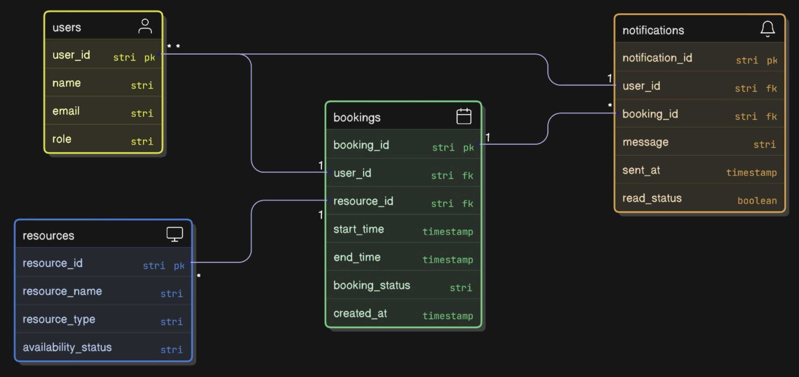

# Smart College Resource Booking System

## Problem Statement
Colleges often have limited shared resources such as classrooms, labs,
and equipment. Manual booking leads to conflicts and double bookings.
This system provides a reliable way to book resources without overlaps.

## Core Features
- View resource availability
- Book a resource for a time slot
- Incharges can approve/reject booking
- Prevent double booking
- Cancel bookings
- Notifications

## Users
- Student
- Resource incharge
- Admin

## Functional Requirements
- Create a booking
- Fetch availability for a resource
- Cancel a booking
- Approve/reject the booking

## Non-Functional Requirements
- Strong consistency for bookings
- Scalability
- Low latency for availability reads
- Reliability

## High-Level Design
This system focuses on correctness under concurrent booking requests.

## Tech Stack (Tentative)
- Frontend: ReactJS
- Backend: Node.js (Express)
- Database: PostgreSQL
- Cache: Redis (for availability reads)
